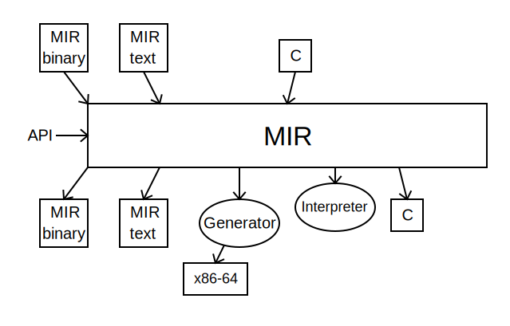

# MIR Project
  * MIR means **M**edium **I**nternal **R**epresentation
  * MIR project goal is to provide a basis to implement fast and light weight interpreters and JITs
  * Plans to try MIR light-weight JIT first for CRuby or/and MRuby implementation

## Disclaimer
   * **This code is in initial stages of development.  It is present
     only for familiarization with the project.  There is absolutely
     no warranty that MIR will not be changed in the future and the
     code will work for any tests except ones given here.**
  
## MIR
  * MIR is strongly typed
  * MIR can represent machine 32-bit and 64-bit insns of different architectures
  * MIR consists of **modules**
    * Each module can contain **functions** and some declarations and data
    * Each function has **signature** (parameter and return types), (currently) fixed size **stack frame**, **local variables** (including function arguments) and **instructions**
      * Each local variable has **type** which can be only 64-bit integer, float, or double
      * Each instruction has **opcode** and **operands**
        * Operand can be a local variable (or a function argument), **immediate**, **memory**, **label**, or **reference**
          * Immediate operand can be 64-bit integer, float or double value
	  * Memory operand has a **type**, **displacement**, **base** and **index** integer local variable,
	    and integer constant as a **scale** for the index
	    * Memory type can be 8-, 16-, 32-, 64-bit signed or unsigned integer type, float type, or double type
	      * When integer memory value is used it is expanded with sign or zero promoting to 64-bit integer value first
	  * Label operand has name and used for control flow instructions
	  * Reference operand is used to refer to functions and declarations in the current module, in other MIR modules,
	    or for C external functions or declarations
	* opcode describes what the instruction does
	* There are **conversion instructions** for conversion between different 32- and 64-bit signed and unsigned values,
	  float and double values
	* There are **arithmetic instructions** (addition, subtraction, multiplication, division, modulo) working
          on 32- and 64-bit signed and unsigned values, float and double values
	* There are **logical instructions** (and, or, xor, different shifts) working on 32- and 64-bit signed and unsigned values
	* There are **comparison instructions**  working on 32- and 64-bit signed and unsigned values, float and double values
	* There are **branch insns** (uncoditional jump, and jump on zero or non-zero value) which take a label
	  as one their operand
	* There are **combined comparison and branch instructions** taking a label as one operand and two 32- and 64-bit
	  signed and unsigned values, float and double values
	* There are **function and procedural call instructions**
	* There are **return instructions** working on 32- and 64-bit ineteger values, float and double values

## MIR Example
  * You can create MIR through **API** consisting functions for creation of modules, functions, instructions, operands etc
  * You can also create MIR from MIR **binary** or **text** file
  * The best way to get a feel about MIR is to use textual MIR representation
  * Example of sieve on C
```
#define Size 819000
int sieve (int N) {
  int64_t i, k, prime, count, n; char flags[Size];

  for (n = 0; n < N; n++) {
    count = 0;
    for (i = 0; i < Size; i++)
      flags[i] = 1;
    for (i = 0; i < Size; i++)
      if (flags[i]) {
        prime = i + i + 3;
        for (k = i + prime; k < Size; k += prime)
          flags[k] = 0;
        count++;
      }
  }
  return count;
}
void ex100 (void) {
  printf ("sieve (100) = %d\", sieve (100));
}
```
  * Example of MIR textual file for the same function:
```
m_sieve:  module
          export sieve
sieve:    func i32, i32:N
          local i64:iter, i64:count, i64:i, i64:k, i64:prime, i64:temp, i64:flags
          alloca flags, 819000
          mov iter, 0
loop:     bge fin, iter, N
          mov count, 0;  mov i, 0
loop2:    bge fin2, i, 819000
          mov u8:(flags, i), 1;  add i, i, 1
          jmp loop2
fin2:     mov i, 0
loop3:    bge fin3, i, 819000
          beq cont3, u8:(flags,i), 0
          add temp, i, i;  add prime, temp, 3;  add k, i, prime
loop4:    bge fin4, k, 819000
          mov u8:(flags, k), 0;  add k, k, prime
          jmp loop4
fin4:     add count, count, 1
cont3:    add i, i, 1
          jmp loop3
fin3:     add iter, iter, 1
          jmp loop
fin:      ret count
          endfunc
          endmodule
m_ex100:  module
format:   string "sieve (10) = %d\n"
p_printf: proto v, p, i32
p_sieve:  proto i32, i32
          export ex100
          import sieve, printf
ex100:    func v, 0
          local i64:r
          call p_sieve, sieve, r, 100
          call p_printf, printf, format, r
          endfunc
          endmodule
```

  * `func` describes signature of the function (taking 32-bit signed
    integer argument and returning 32-bit signed integer value), stack
    frame size (819000) and function argument `N` which will be local
    variable of 64-bit signed integer type
  * `fp` is a reserved local varaible whose value is address of the function stack frame
  * You can write several instructions on one line if you separate them by `;`
  * The instruction result, if any, is always the first operand
  * We use 64-bit instructions in calculations
  * We could use 32-bit instructions in calculations which would have sense if we use 32-bit CPU
    * When we use 32-bit instructions we take only 32-bit significant part of 64-bit operand and high 32-bit part
      of the result is machine defined (so if you write a portable MIR code consider the high 32-bit part value is undefined)
  * `string` describes data in form of C string
     * C string can be used directly as an insn operand.  In this case the data will be added to the module and
       the data address will be used as an operand
  * `export` describes module functions or data which are visible outside the current module
  * `import` describes module functions or data which should be defined in other MIR modules
  * `proto` describes function prototypes
  * `call` are MIR instruction to call functions

## Running MIR code
  * After creating MIR modules (through MIR API or reading MIR binary or textual files), you should load the modules
    * Loading modules makes visible exported module functions and data
    * You can load external C function with `MIR_load_external`
  * After loading modules, you should link the loaded modules
    * Linking modules resolves imported module references, initializes data, and set up call interfaces
  * After linking, you can interpret functions from the modules or create machine code
    for the functions with MIR JIT compiler (generator) call this code
  * Running code from above example could look the following (here `m1` and `m2` are modules `m_sieve` and `m_e100`,
    `func` is function `ex100`, `sieve` is function `sieve`):
```
    MIR_load_module (m1); MIR_load_module (m2); MIR_load_external ("printf", printf);
    MIR_link (MIR_set_interp_interface);
    /* or MIR_gen (MIR_set_gen_interface); to generate and use the machine code */
    MIR_interp (func, 0); /* zero here is arguments number  */
    /* or ((void (*) (void)) func->addr) (); to call interpreter or generated code through the interface */
```

  * If you generate machine code for a function, you should also generate
    code for all called functions.  In the future a lazy automatic
    generation of called functions will be implemented.

## The current state of MIR project

  

  * MIR support of **varargs** (variable number of arguments), **alloca**, and **longjump** is not implemented yet
  * Binary MIR code is usually about **3 times more compact** and **4 times faster to read** than analagous MIR textual code
  * MIR interpreter is about 6-10 times slower than code generated by MIR JIT compiler
  * MIR to C compiler is currently about 70% implemented

## The possible future state of MIR project
  

  * WASM to MIR and MIR to WASM translation should be pretty straitforward
    * Only small WASM runtime for WASM floating point round instructions needed to be provided for MIR
  * Implementation of Java byte code to/from MIR and LLVM IR to/from MIR compilers will be a challenge:
    * big runtime and possibly MIR extensions will be required
  * Porting GCC to MIR is possible too.  An experienced GCC developer can implement this for 6 to 12 months
  * On my estimation porting MIR JIT compiler to aarch64, ppc64, and mips will take 1-2 months of work for each target
  * Performance minded porting MIR JIT compiler to 32-bit targets will need an implementaion of additional
    small analysis pass to get info what 64-bit variables are used only in 32-bit instructions
    
## MIR JIT compiler
  * Compiler **Performance Goals** relative to GCC -O2:
    * 70% of generated code speed
    * 100 times faster compilation speed
    * 100 times faster start-up
    * 100 times smaler code size
    * less 10K C LOC
  * Very short optimization pipeline for speed and light-weight
  * Only the **most valuable** optimization usage:
    * **function inlining**
    * **global common sub-expression elimination**
    * **sparse conditional constant propagation**
    * **dead code elimination**
    * **code selection**
    * fast **register allocator** with implicit coalescing hard registers and stack slots for copy elimination
  * **No SSA** (single static assignment form) usage for faster optimizations
    * If we implement more optimizations, SSA transition is possible when additional time for expensive in/out SSA passes
      will be less than additional time for non-SSA optimization implementation
  * Simplicity of optimizations implementation over extreme generated code performance
  * More detail **JIT compiler pipeline**:

  * **Simplify**: lowering MIR
  * **Build CFG**: builing Control Flow Graph (basic blocks and CFG edges)
  * **Global Common Sub-Expression Elimination**: reusing calculated values
  * **Dead Code Elimination**: removing insns with unused outputs
  * **Sparse Conditional Constant Propagation**: constant propagation and removing death paths of CFG
  * **Machinize**: run machine-dependent code transforming MIR for calls ABI, 2-op insns, etc
  * **Building Live Info**: calculating live in and live out for the basic blocks
  * **Build Live Ranges**: calculating program point ranges for registers
  * **Assign**: priority-based assigning hard regs and stack slots to registers
  * **Rewrite**: transform MIR according to the assign using reserved hard regs
  * **Combine** (code selection): merging data-depended insns into one
  * **Dead Code Elimination**: removing insns with unused outputs. 
  * **Generate Machine Insns**: run machine-dependent code creating machine insns
  
## C to MIR compiler
  * Implemention of a small C11 (2011 ANSI C standard) to MIR compiler
    * no optional features: variable size arrays, complex, atomic
  * Minimal compiler code dependency.  No additional tools (like yacc/flex) are used
  * Simplicity of implementation over speed to make code easy to learn and maintain
    * Four passes to divide compilation on manageable sub-tasks:
      1. Preprocessor pass generating tokens
      2. Parsing pass generating AST (Abstract Syntax Tree). To be close ANSI standard grammar as soon as possible,
         [**PEG**](https://en.wikipedia.org/wiki/Parsing_expression_grammar) manual parser is used
      3. Context pass checking context constraints and augmenting AST
      4. Generation pass producing MIR

  

## Structure of the project code
 * Files `mir.h` and `mir.c` contain major API code including input/output of MIR binary and MIR text representation
 * Files `mir-dlist.h`, `mir-mp.h`, `mir-varr.h`, `mir-bitmap.h`, `mir-htab.h` contain generic code correspondingly for
   double-linked lists, memory pools, variable length arrays, bitmaps, hash tables.
   File `mir-hash.h` is a general, simple, high quality hash function used by hashtables
 * Files `mir-interp.h` and `mir-interp.c` contain code for intepretation of MIR code
 * Files `mir-gen.h`, `mir-gen.c`, and `mir-gen-x86_64.c` contain code for MIR JIT compiler
   * File `mir-gen-x86_64.c` is machine dependent code of JIT compiler
 * Files `mir-<target>.c` contain simple machine dependent code common for interpreter and JIT compiler 
 * Files `mir2c/mir2c.h` and `mir2c/mir2c.c` contain code for MIR to C compiler
 * Files `c2mir/c2mir.c`, `c2mir/cx86_64-code.c`, and `c2mir/cx86_64.h` contain code for C to MIR compiler
   
## Playing with current MIR project code
  * MIR project is far away from any serious usage
  * The current code can be used only to familiarize future users with the project and approaches it uses
  * You can run some benchmarks and tests by `make bench` and `make test`

## Current MIR Performance Data

  * Intel i7-9700K with 16GB memory under FC29 with GCC-8.2.1

    |                |     MIR-gen      |     MIR-interp  |     gcc -O2      |     gcc -O0     |
    |----------------|------------------|-----------------|------------------|-----------------|
    | compilation [1]| **1.0** (75us)   | 0.16 (12us)     | **178** (13.35ms)|  171 (12.8ms)   |
    | execution [2]  | **1.0** (3.1s)   | 5.9 (18.3s)     | **0.94** (2.9s)  |  2.05 (6.34s)   |
    | code size [3]  | **1.0** (175KB)  | 0.65 (114KB)    | **144** (25.2MB) |  144 (25.2MB)   |
    | startup [4]    | **1.0** (1.3us)  | 1.0 (1.3us)     | **9310** (12.1ms)|  9850 (12.8ms)  |
    | LOC [5]        | **1.0** (9.5K)   | 0.58 (5.5K)     | **155** (1480K)  |  155 (1480K)    |

   [1] is based on wall time of compilation of sieve code (w/o any include file and with using memory file system for GCC) 100 times

   [2] is based on the best wall time of 10 runs

   [3] is based on stripped sizes of cc1 for GCC and MIR core and interpreter or generator for MIR

   [4] is based on wall time of generation of object code for empty C file or generation of empty MIR module through API

   [5] is based only on files required for x86-64 C compiler and files for minimal program to create and run MIR code

## MIR project competitors
  * I only see two real universal light-weight JIT competitors
  * [**LIBJIT**](https://www.gnu.org/software/libjit/) started as a part of DotGNU Project:
    * LIBJIT is bigger:
      * 80K C lines (for LIBJIT w/o dynamic Pascal compiler) vs 10K C lines for MIR (excluding C to MIR compiler)
      * 420KB object file vs 170KB
    * LIBJIT has fewer optimizations: only copy propagation and register allocation
  * [**RyuJIT**](https://github.com/dotnet/coreclr/blob/master/Documentation/botr/ryujit-overview.md) is a part of runtime for .NET Core:
    * RyuJIT is even bigger: 360K SLOC
    * RyuJIT optimizations is basically MIR-generator optimizations plus loop invariant motion minus SCCP
    * RyuJIT uses SSA
  * Other candidates:
    * [**QBE**](https://github.com/8l/qbe): standalone+, small+ (10K LOC), SSA-, ASM generation-, MIT License
    * [**LIBFirm**](https://github.com/libfirm/libfirm): less standalone-, big- (140K LOC), SSA-, ASM generation-, LGPL2
    * [**CraneLift**](https://github.com/CraneStation/cranelift): less standalone-, big- (70K LOC of Rust-), SSA-, Apache License
